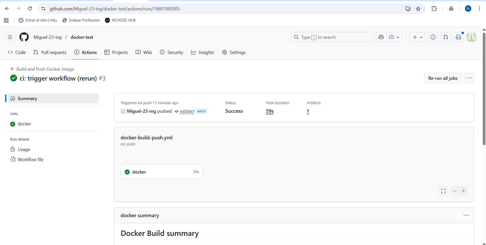
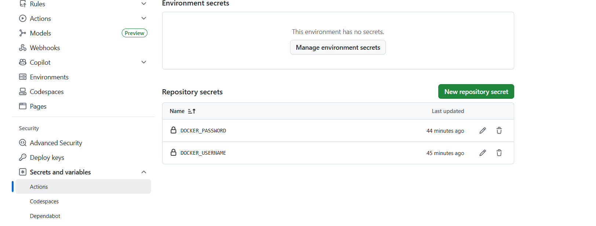
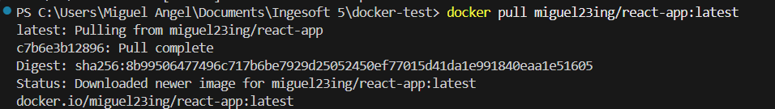
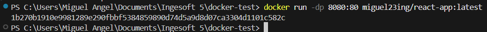
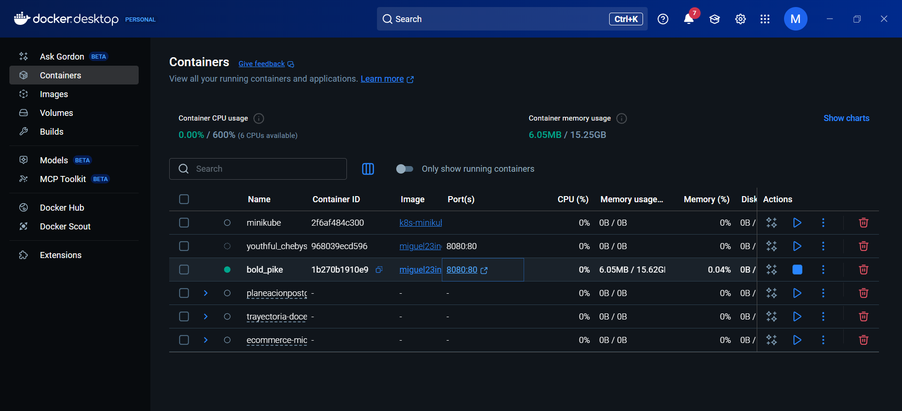
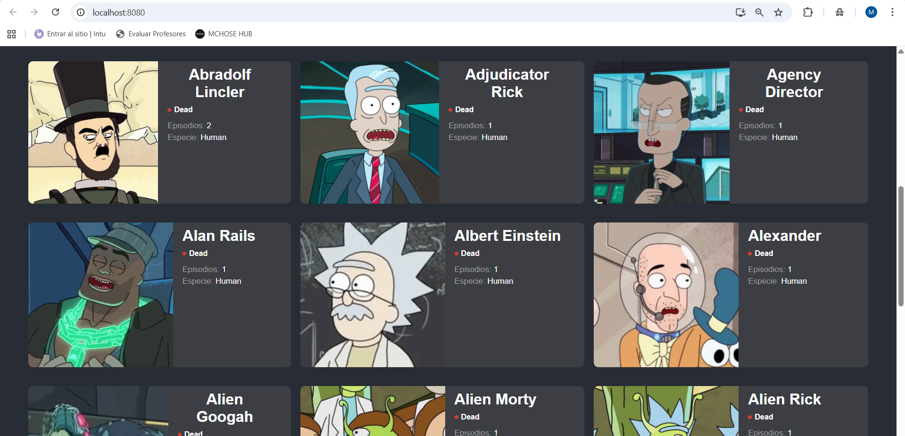

# Aplicación React — Docker + GitHub Actions → Docker Hub

Resumen rápido
----------------

Este repositorio contiene una aplicación React preparada para producción, una imagen Docker multi-stage que la sirve con `nginx` y un workflow de GitHub Actions que construye la imagen y la publica en Docker Hub automáticamente al hacer push a la rama `main`.

Contenido del README
---------------------
- Qué se implementó (pasos)
- Requisitos
- Cómo probar localmente
- Descripción del workflow de CI
- Cómo añadir los *secrets* en GitHub
- Comandos útiles (build, run, stop, remove)
- Espacios para capturas (Docker Desktop, app corriendo, workflow, secrets, consola)

## 1. Qué se hizo (resumen)
-------------------------

1. Se creó un `Dockerfile` multi-stage que construye la app con Node y sirve los archivos estáticos con `nginx`.
2. Se añadió un workflow de GitHub Actions en `.github/workflows/docker-build-push.yml` que hace checkout, configura Buildx, se loguea a Docker Hub usando secrets y construye + publica la imagen.
3. Se configuraron los secrets `DOCKER_USERNAME` y `DOCKER_PASSWORD` (token de Docker Hub con permisos Read & Write) en el repositorio.
4. Se probó la imagen localmente y también se confirmó que la imagen pública fue subida a Docker Hub (`miguel23ing/react-app:latest`).

## 2. Requisitos
------------

- `git`
- `docker` (Docker Desktop o Docker Engine) instalado y en ejecución
- Cuenta en Docker Hub (para publicar la imagen)
- Secrets configurados en el repositorio de GitHub

## 3. Archivos importantes
-----------------------

- `Dockerfile` (en la raíz)
- `.dockerignore`
- `.github/workflows/docker-build-push.yml`

4. Dockerfile (estructura usada)
--------------------------------

Ejemplo de `Dockerfile` multi-stage utilizado (se construye con Node y se sirve con nginx):

```dockerfile
# Etapa de build
FROM node:18-alpine AS build
WORKDIR /app
COPY package*.json ./
RUN npm install
COPY . .
RUN npm run build

# Etapa de producción (nginx)
FROM nginx:1.24-alpine
COPY --from=build /app/build /usr/share/nginx/html
EXPOSE 80
CMD ["nginx", "-g", "daemon off;"]
```

## 5. Workflow de GitHub Actions
----------------------------

Ruta: `.github/workflows/docker-build-push.yml`

El flujo básico hace lo siguiente:

- `on: push` a `main` (y PRs)
- `actions/checkout` para obtener el código
- `docker/setup-buildx-action` para buildx
- `docker/login-action` usando `secrets.DOCKER_USERNAME` y `secrets.DOCKER_PASSWORD`
- `docker/build-push-action` para construir y subir la imagen con el tag `${{ secrets.DOCKER_USERNAME }}/react-app:latest`

Ejemplo (resumido):

```yaml
name: Build and Push Docker Image

on:
	push:
		branches: [ main ]

jobs:
	docker:
		runs-on: ubuntu-latest
		steps:
			- uses: actions/checkout@v4
			- uses: docker/setup-buildx-action@v3
			- uses: docker/login-action@v3
				with:
					username: ${{ secrets.DOCKER_USERNAME }}
					password: ${{ secrets.DOCKER_PASSWORD }}
			- uses: docker/build-push-action@v6
				with:
					context: .
					push: true
					tags: ${{ secrets.DOCKER_USERNAME }}/react-app:latest
```


## 6. Crear el token en Docker Hub y añadirlo como secret en GitHub
--------------------------------------------------------------

1. En Docker Hub → `Settings` → `Security` → `Access Tokens` → `Create` → seleccionar permisos **Read & Write** → copiar token.
2. En GitHub → repo → `Settings` → `Secrets and variables` → `Actions` → `New repository secret`:
	 - `DOCKER_USERNAME` = tu usuario de Docker Hub (ej: `miguel23ing`)
	 - `DOCKER_PASSWORD` = el token que copiaste


## 7. Cómo probar localmente
-------------------------

Build y ejecutar localmente (desde la raíz del repo):

```powershell
docker build -t miguel23ing/react-app:latest .
docker run -dp 8080:80 --name react-app-local miguel23ing/react-app:latest
# Abrir http://localhost:8080
```

Probar a traer la imagen desde Docker Hub (otra máquina):

```powershell
docker pull miguel23ing/react-app:latest
docker run -dp 8080:80 --name react-app-remote miguel23ing/react-app:latest
# Abrir http://localhost:8080
```







## 8. Comandos útiles
------------------

- Listar contenedores en ejecución: `docker ps`
- Ver logs: `docker logs -f <CONTAINER_NAME>`
- Parar: `docker stop <CONTAINER_NAME>`
- Eliminar: `docker rm <CONTAINER_NAME>`
- Eliminar imagen local: `docker rmi <IMAGE>`


